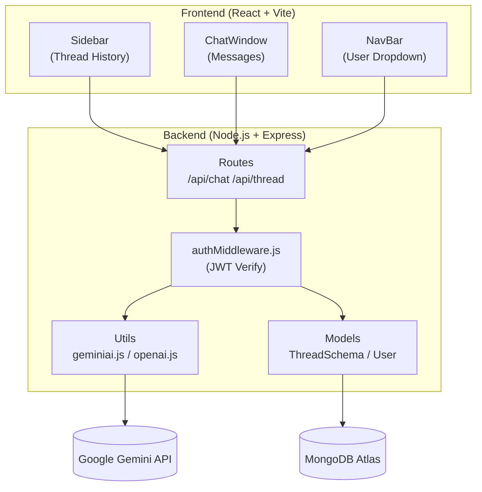
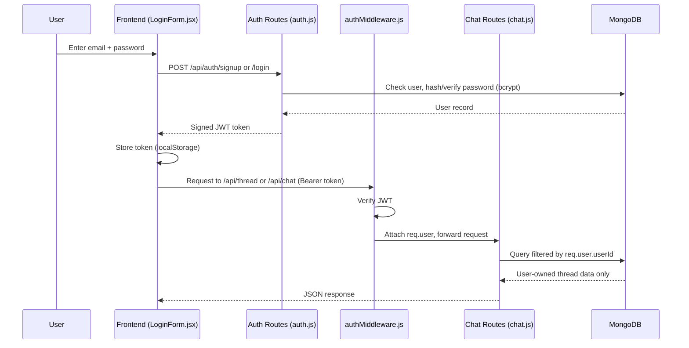

<div align="center">

# 🧠 StackMind
### Scalable Full-Stack AI Chatbot — MERN + Google Gemini API

A production-grade, thread-based conversational AI chatbot built from scratch with the MERN stack — not just another ChatGPT wrapper.


### 🔗 [**Live Demo →**](https://stack-mind-dusky.vercel.app/)

</div>

---

## 📸 Preview

<div align="center">

### 🏠 Home Page — StackMind AI Chatbot


</div>

---

## 📚 Table of Contents

- [What is StackMind?](#-what-is-stackmind)
- [Core Features](#-core-features)
- [Tech Stack](#-tech-stack)
- [System Architecture](#-system-architecture)
- [Authentication Flow](#-authentication-flow)
- [Backend Architecture](#-backend-architecture)
- [Frontend Architecture](#-frontend-architecture)
- [Installation Guide](#-installation-guide)
- [Project Structure](#-project-structure)
- [API Routes Documentation](#-api-routes-documentation)
- [Performance Optimizations](#-performance-optimizations)
- [Future Roadmap](#-future-roadmap)
- [Performance Metrics](#-performance-metrics)
- [Security Practices](#-security-practices-implemented)
- [Contributing](#-contributing)
- [FAQ](#-faq)
- [Author & Support](#-author--support)

---

## 🤖 What is StackMind?

**StackMind** is an enterprise-grade, full-stack conversational AI chatbot built using the **MERN Stack** (MongoDB, Express.js, React.js, Node.js) and powered by the **Google Gemini 2.5 Flash API**.

| Problem | StackMind Solution |
|---|---|
| Generic ChatGPT wrappers | Custom-built from the ground up for real use cases |
| No chat history management | Thread-based MongoDB architecture with message tracking |
| Poor UI/UX | 40ms word-by-word typing effect for a human-like feel |
| Difficult to scale | RESTful API design ready for Docker, K8s, and microservices |
| Scattered codebase | Clean separation: Models → Utils → Routes |

---

## ✨ Core Features

- 🧵 **Thread-Based Chat Management** — each conversation is an independent, timestamped thread with auto-generated titles
- 📝 **Rich Message Formatting** — full Markdown rendering + syntax-highlighted code blocks (`rehype-highlight`, multiple themes)
- ⌨️ **Human-Like Typing Animation** — word-by-word streaming effect at 40ms intervals
- 🔐 **JWT Authentication** — signup/login with hashed passwords and ownership-based access control
- 🔌 **RESTful API** — clean `/api/thread` and `/api/chat` endpoints
- 🤝 **Multi-LLM Ready** — Gemini 2.5 Flash primary, OpenAI fallback, extensible to Claude/Grok/LLaMA

---

## 🛠️ Tech Stack

### Frontend

| Technology | Purpose | Version |
|---|---|---|
| React.js | UI framework | 18.x+ |
| Vite | Build tool | 4.x+ |
| Context API | State management | Built-in |
| react-markdown | Markdown rendering | Latest |
| rehype-highlight | Code syntax highlighting | Latest |
| uuid | Unique thread IDs | Latest |
| Tailwind / Custom CSS | Styling | — |
| Font Awesome | Icons | 7.0.1+ |

### Backend

| Technology | Purpose | Details |
|---|---|---|
| Node.js | Runtime | LTS recommended |
| Express.js | Web framework | 4.x+ |
| MongoDB | Database | Atlas or local |
| Mongoose | ODM | Schema validation |
| dotenv | Env config | Secure API keys |
| jsonwebtoken | Auth | JWT signing/verification |
| bcryptjs | Password hashing | Salted hashes |
| Google Gemini API | Primary AI model | `gemini-2.5-flash` |
| OpenAI API | Fallback AI | `gpt-4o-mini` |

### Planned DevOps
Docker · Kubernetes · GitHub Actions CI/CD

---

## 🏗️ System Architecture



---

## 🔐 Authentication Flow



**Why this matters:** every thread is linked to a `userId`, and every read/delete/write is filtered by `req.user.userId` — so one user can never access or hijack another user's chat thread.

---

## 🗄️ Backend Architecture

**ThreadSchema**
```javascript
{
  threadId: String,   // unique, generated via uuid
  userId: ObjectId,   // owner reference
  title: String,      // auto-generated from first message
  messages: [MessageSchema],
  createdAt: Date,
  updatedAt: Date
}
```

**MessageSchema**
```javascript
{
  content: String,          // message text
  role: "user" | "assistant",
  timestamp: Date
}
```

---

## 🎨 Frontend Architecture

| Component | Responsibility |
|---|---|
| `App.jsx` | Root component, holds global state (prompt, reply, threads, auth) |
| `Sidebar.jsx` | Thread list, "New Chat" button, delete action |
| `ChatWindow.jsx` | Hosts NavBar + Chat + InputBox |
| `Chat.jsx` | Renders messages, drives the typing animation |
| `MyContext.jsx` | Context API provider shared across the app |

**Typing animation (word-by-word, 40ms):**
```javascript
const content = reply.split(" ");
let idx = 0;
const interval = setInterval(() => {
  setLatestReply(content.slice(0, idx + 1).join(" "));
  idx++;
  if (idx >= content.length) clearInterval(interval);
}, 40);
```

---

## 📦 Installation Guide

### Prerequisites
- Node.js v14+
- npm or yarn
- MongoDB (local or Atlas)
- Google Gemini API key

### 1. Clone the repo
```bash
git clone https://github.com/vivekkr620/StackMind.git
cd StackMind
```

### 2. Backend setup
```bash
cd Backend
npm install

# create .env
cat > .env << EOF
MONGODB_URL=your_mongodb_connection_string
GEMINI_API_KEY=your_gemini_api_key_here
OPENAI_API_KEY=your_openai_api_key_here   # optional
JWT_SECRET=your_jwt_secret
PORT=8080
EOF

npm start
# or, for auto-reload during development
npx nodemon server.js
```

### 3. Frontend setup
```bash
cd Frontend
npm install
npm run dev
```

### 4. Verify
```bash
# Backend → http://localhost:8080
curl http://localhost:8080/api/thread

# Frontend → http://localhost:5173
```

---

## 📁 Project Structure

```
StackMind/
├── Backend/
├── middleware/
│   └── authMiddleware.js
├── models/
│   ├── Thread.js
│   └── User.js
├── routes/
│   ├── auth.js
│   └── chat.js
├── utils/
│   └── geminiai.js
├── server.js
└── package.json
```
```
├── Frontend/
├── public/
├── src/
│   ├── assets/
│   ├── components/
│   │   └── LoginForm.jsx
│   ├── App.css
│   ├── App.jsx
│   ├── Chat.css
│   ├── Chat.jsx
│   ├── ChatWindow.css
│   ├── ChatWindow.jsx
│   ├── index.css
│   ├── main.jsx
│   ├── MyContext.jsx
│   ├── Sidebar.css
│   └── Sidebar.jsx
├── index.html
├── vite.config.js
├── eslint.config.js
└── package.json
│
└── README.md
```

---

## 🔌 API Routes Documentation

**Base URL:** `http://localhost:8080/api`

| Method | Route | Auth | Description |
|---|---|---|---|
| `GET` | `/thread` | ✅ | List all threads for the logged-in user, sorted by `updatedAt` desc |
| `GET` | `/thread/:threadId` | ✅ | Fetch all messages in a specific thread |
| `POST` | `/chat` | ✅ | Send a message, get an AI reply, persist both |
| `DELETE` | `/thread/:threadId` | ✅ | Delete a thread (ownership-checked) |

**Example — `POST /chat`**
```javascript
// Request
{
  "threadId": "abc-123-def",
  "message": "What is React?"
}

// Response (200)
{
  "reply": "React is a JavaScript library for building user interfaces..."
}

// Response (403) — cross-user hijack attempt
{
  "error": "You are not allowed to access this chat"
}
```

---

## ⚡ Performance Optimizations

**Frontend:** lazy-loaded sidebar history · debounced thread search · `React.memo()` on heavy components · code-splitting

**Backend:** indexed `threadId` lookups · pagination on thread lists · MongoDB Atlas connection pooling · gzip response compression

| Endpoint | Typical Response Time |
|---|---|
| `GET /thread` | ~100–150ms (1000 threads) |
| `GET /thread/:threadId` | ~50–80ms |
| `POST /chat` | ~2–3s (Gemini API latency) |
| `DELETE /thread/:threadId` | ~100–120ms |

---

## 🚀 Future Roadmap

- [x] JWT authentication
- [ ] OAuth login (Google/GitHub)
- [ ] Voice input via Whisper API
- [ ] Dark/Light theme toggle
- [ ] Full mobile responsiveness
- [ ] Full-text thread search
- [ ] Rate limiting
- [ ] Docker + Kubernetes deployment
- [ ] Redis caching layer
- [ ] Multi-LLM fallback router (Claude/Grok)
- [ ] Streaming responses via SSE
- [ ] RAG with custom documents
- [ ] File upload & document processing

---

## 📊 Performance Metrics

| Metric | Target | Current |
|---|---|---|
| Time to First Byte | < 200ms | ~150ms |
| First Contentful Paint | < 1.5s | ~1.2s |
| Largest Contentful Paint | < 2.5s | ~2.0s |
| Cumulative Layout Shift | < 0.1 | ~0.05 |
| Time to Interactive | < 3.5s | ~3.0s |

---

## 🔐 Security Practices Implemented

- ✅ Environment variables for all secrets
- ✅ CORS restricted to frontend origin
- ✅ Server-side input validation
- ✅ Generic error responses (no stack traces leaked)
- ✅ Mongoose schema validation (injection prevention)
- ✅ Password hashing with bcrypt + salt
- ✅ Ownership checks on every thread operation
- ⏳ Rate limiting (planned)

---

## 🤝 Contributing

```bash
# 1. Fork & clone
git clone https://github.com/vivekkr620/StackMind.git

# 2. Create a feature branch
git checkout -b feature/amazing-feature

# 3. Commit your changes
git commit -m "Add amazing feature"

# 4. Push and open a PR
git push origin feature/amazing-feature
```

Please follow existing code style, use meaningful variable names, and test before submitting a PR.

---

## ❓ FAQ

**Can I use StackMind in production?**
Yes — it follows production patterns: input validation, error handling, and environment-based config.

**How much does it cost to run?**
Google Gemini has a generous free tier; check Google AI Studio for current pricing.

**Can I deploy to AWS/Azure?**
Yes, once Docker/K8s support lands (see roadmap) — until then, any Node-compatible host works.

**What happens if I hit Gemini's rate limit?**
The planned multi-LLM router will automatically fall back to another model.

---

## 👨‍💻 Author & Support

**Vivek Kumar** — Full-Stack Developer, MERN Stack & AI Integrations

- 🔗 [LinkedIn](https://www.linkedin.com/in/vivek-kumar011/)
- 📝 [Medium Article](https://medium.com/@vk431152/building-stackmind-architecting-a-scalable-full-stack-ai-chatbot-using-mern-c69f5e58fc18)
- 🐙 [GitHub](https://github.com/vivekkr620)
- 📧 vk431152@gmail.com

Found a bug or have a feature idea? Open a [GitHub Issue](https://github.com/vivekkr620/StackMind/issues) or start a Discussion.

---

<div align="center">

⭐ If this project helped you, consider giving it a star! ⭐

Made with ❤️ by **Vivek Kumar**

[⬆ Back to Top](#-stackmind)

</div>